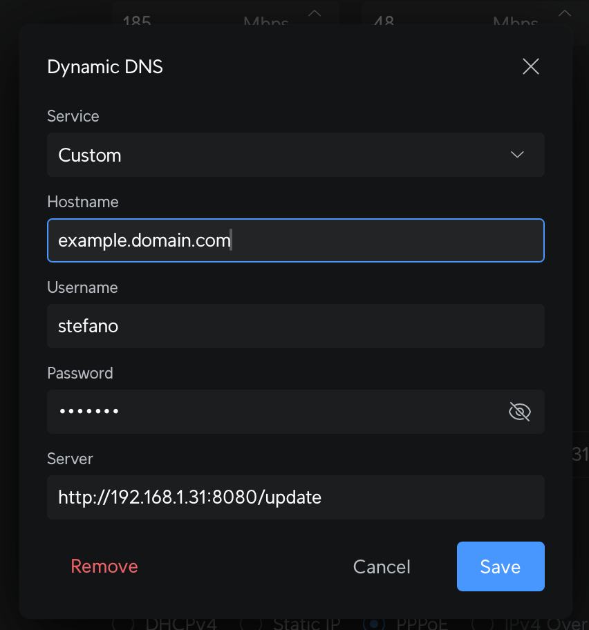

# go-ddns

Update Cloudflare DNS records from Unifi Gateway request.

## How it works

When Unifi Gateway detect new IP address it send request to `go-ddns` container.
The `go-ddn` container check if domain exists in Cloudflare and update it ip address.

## Configuration

### Docker

```bahs
docker run -d \
    -e CF_API_TOKEN=<cloudflare-api-token> \
    -e CF_ZONE_ID=<cloudflare-zone-id> \
    -e AUTH_USERNAME=<username> \
    -e AUTH_PASSWORD=<password> \
    --name ddns \
    ghcr.io/stefanopulze/go-ddns:latest
```

When start docker container set envs:

- `CF_API_TOKEN`: Cloudflare API token
- `CF_ZONE_ID`: Cloudflare Zone ID (You can find it in Cloudflare dashboard)
- `AUTH_USERNAME`: Username for authenticated update request
- `AUTH_PASSWORD`: Password for authenticated update request

### Unifi Controller

In your Unifi Controller go to `Settings -> Network -> Dynamic DNS` and set the following:

- Service: `Custom`
- Hostname: `ddns.example.com` (enter your domain to update, need exits in Cloudflare)
- Username: `example` (enter username from envs)
- Password: `example` (enter password from envs)
- Server: `http://container-ip:8080/update`

Then press "Create"



## Manual trigger

You can trigger update manually by sending request to `http://container-ip:8080/update` and
pass the header `Authorization: Basic <base64(username:password)>`.